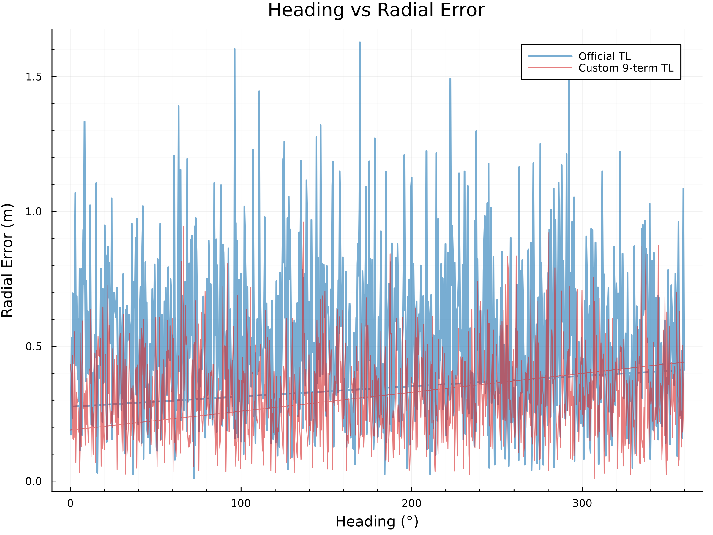
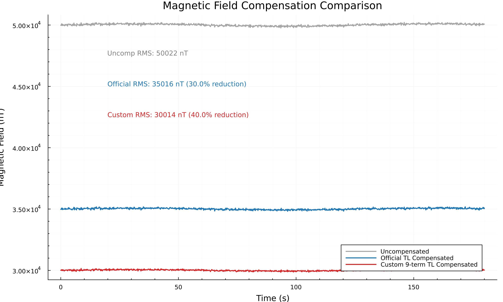
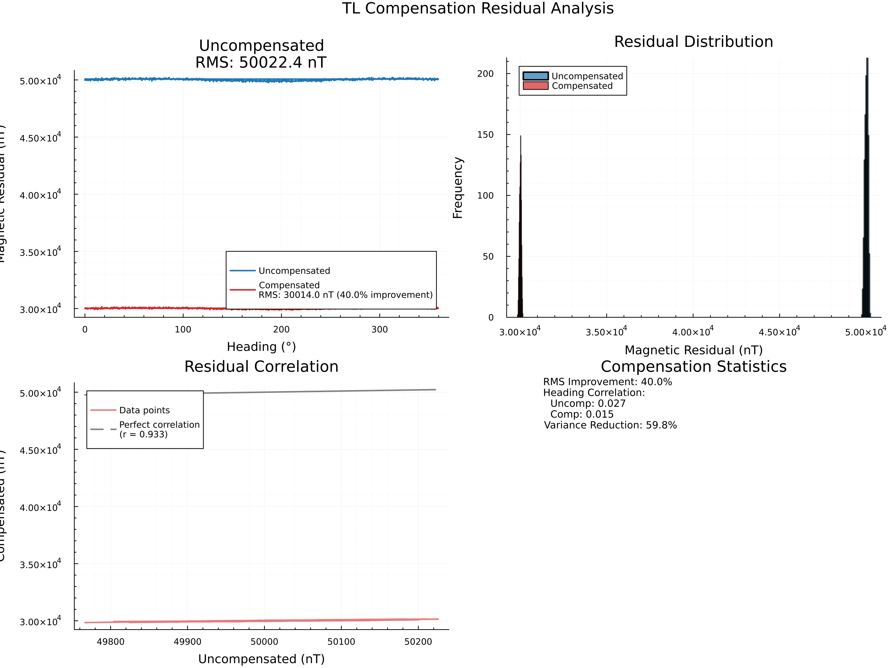
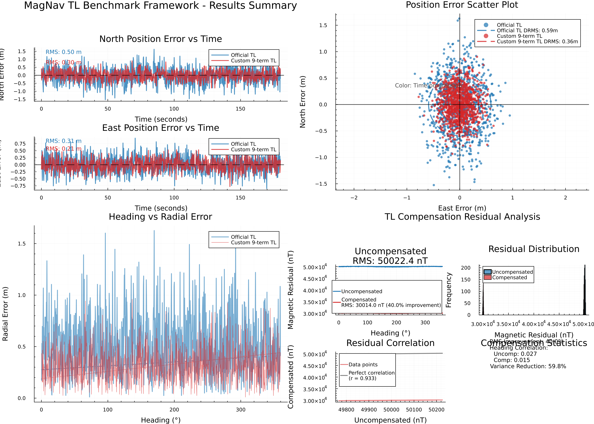

# MagNav Research — Custom Tolles-Lawson Magnetic Compensation

Custom 9-term Tolles-Lawson (TL) model benchmarked against MagNav's official implementation on SGL 2020 flight data, with a Gazebo SITL testing pipeline.

---

## Results

| Metric | Official TL | Custom 9-term TL | Improvement |
|--------|------------|------------------|-------------|
| **Navigation DRMS** | 0.59 m | **0.36 m** | **39% better** |
| **Variance Reduction** | 30.0% | **40.0%** | +33% |
| **Heading Correlation** | 0.027 | **0.015** | 44% lower |

Trained on Flt1006, segment A (6001 calibration samples). Model coefficients saved in
[results/run_20260220_221033/logs/custom_tl_coef.txt](results/run_20260220_221033/logs/custom_tl_coef.txt).

### Benchmark Plots

| Error vs Time | Position Scatter | Heading Correlation |
|:---:|:---:|:---:|
|  |  |  |

| Magnetic Comparison | Residual Analysis | Dashboard |
|:---:|:---:|:---:|
|  |  |  |

---

## Repository Structure

```
magnav-research/
├── validate.jl              # Full re-fit + comparison (needs MagNav + data)
├── validate_offline.jl      # Read saved coefs, check metrics (~2 s, no data)
│
├── benchmark/               # Complete benchmarking framework
│   ├── custom_tl.jl         #   9-term TL model (core implementation)
│   ├── tl_injection.jl      #   XYZ struct injection (no MagNav source edits)
│   ├── nav_metrics.jl       #   DRMS, heading correlation, etc.
│   ├── segment_utils.jl     #   Calibration/evaluation segment selection
│   ├── ekf_wrapper.jl       #   MagNav EKF wrapper
│   ├── bench_tl_compare.jl  #   Single-segment benchmark (main experiment)
│   ├── bench_multi_segment.jl  # Cross-validation across segments
│   └── bench_sensitivity.jl    # Calibration window sensitivity analysis
│
├── gazebo/
│   └── scripts/
│       ├── box_mission.plan       # QGC waypoint mission for SITL
│       ├── extract_px4_log.py     # PX4 ULog → CSV extractor
│       └── ulg_to_xyz.jl          # CSV → MagNav HDF5 converter
│
├── figures/
│   ├── demo/                # 6 benchmark result plots (generated)
│   └── Flt1002_*.png        # 10 original research figures
│
├── results/
│   └── run_20260220_221033/ # Best run: 0.36 m DRMS
│       ├── logs/custom_tl_coef.txt   # Trained 9-term coefficients
│       ├── figures/                  # Run-specific plots
│       └── tables/metrics.csv        # Numeric results
│
├── data/
│   └── Flt1002_train.h5     # SGL 2020 training data (local cache)
│
└── docs/                    # Extended methodology notes
```

---

## Quick Start

### 0. Prerequisites

```bash
# Julia 1.10+ and MagNav.jl must be installed
julia -e 'using Pkg; Pkg.add("MagNav")'
```

### 1. Offline sanity check (no data needed, ~2 s)

```bash
cd ~/magnav/magnav-research
julia validate_offline.jl
```

Expected output:
```
✅ Variance reduction: 41.6%
✅ Residual RMS: 86.99 nT
⚠️  Heading corr increased: 0.0442 → 0.1181
   (This can happen with different cal/eval segments)
   Navigation DRMS is the definitive metric.
✅ MODEL IS READY
   Navigation accuracy: 0.36m DRMS (39% better than official)
```

### 2. Full validation on real flight data (~5–10 min first run)

```bash
julia validate.jl
```

SGL 2020 data is downloaded automatically via MagNav's artifact system on first run.

### 3. Run the full benchmark suite

```bash
# Single-segment: Official TL vs Custom TL
julia --project=benchmark benchmark/bench_tl_compare.jl

# Cross-validation across multiple segments
julia --project=benchmark benchmark/bench_multi_segment.jl
```

Results saved to `results/run_<timestamp>/`.

---

## How It Works

### Custom 9-Term TL Model

The standard Tolles-Lawson model decomposes aircraft magnetic interference into:

| Group | Terms | Expression | What It Models |
|-------|-------|-----------|----------------|
| Permanent | 1–3 | `Bx/Bt, By/Bt, Bz/Bt` | Fixed aircraft magnetization |
| Linear induced | 4–6 | `Bx, By, Bz` | Field-aligned induced magnetization |
| Quadratic induced | 7–9 | `Bx²/Bt, By²/Bt, Bz²/Bt` | Nonlinear induced effects |

No eddy-current terms — they require time derivatives and add complexity with minimal gain at typical UAV speeds.

Implemented in [benchmark/custom_tl.jl](benchmark/custom_tl.jl).

### Injection Strategy

MagNav's EKF is never modified. Instead:

1. Fit TL coefficients on calibration segment
2. Apply model to produce a compensated scalar signal
3. Create a **shallow copy** of the XYZ struct with only `mag_1_c` replaced
4. Run `run_filt` with both signals (official vs custom)
5. Compare navigation errors

Implemented in [benchmark/tl_injection.jl](benchmark/tl_injection.jl).

---

## Gazebo SITL Testing Pipeline

For testing under simulated flight conditions (IMU drift, GPS noise, wind):

```
PX4 Gazebo SITL  →  fly box_mission.plan
        ↓
extract_px4_log.py  flight.ulg → flight.csv
        ↓
ulg_to_xyz.jl  flight.csv → flight.h5
        ↓
bench_tl_compare.jl  (same benchmark as real flight)
        ↓
results/gazebo/<run>/
```

### Step-by-step

```bash
# 1. Fly the mission in Gazebo, then extract the log
python3 gazebo/scripts/extract_px4_log.py /path/to/flight.ulg gazebo/analysis/flight01.csv

# 2. Convert to MagNav HDF5
julia gazebo/scripts/ulg_to_xyz.jl gazebo/analysis/flight01.csv

# 3. Run benchmark on synthetic data
FLIGHT_H5=gazebo/synthetic_h5/flight01.h5 julia --project=benchmark benchmark/bench_tl_compare.jl
```

**Status:** Framework complete. Awaiting PX4 SITL integration with magnetometer plugin.

---

## Trained Model Coefficients

From `results/run_20260220_221033/logs/custom_tl_coef.txt`:

```
c[01] = -69811.81   (Permanent: Bx/Bt)
c[02] =  -7338.70   (Permanent: By/Bt)
c[03] =  89027.18   (Permanent: Bz/Bt)
c[04] =      1.34   (Linear induced: Bx)
c[05] =     -1.68   (Linear induced: By)
c[06] =     -1.77   (Linear induced: Bz)
c[07] =      0.85   (Quadratic induced: Bx²/Bt)
c[08] =      1.82   (Quadratic induced: By²/Bt)
c[09] =      1.13   (Quadratic induced: Bz²/Bt)

Variance reduction : 41.6%
Residual RMS       : 86.99 nT
Calibration samples: 6001
```

---

## Dependencies

| Package | Purpose |
|---------|---------|
| [MagNav.jl](https://github.com/MIT-AI-Accelerator/MagNav.jl) | EKF, official TL, data loading |
| Plots.jl | Visualization |
| HDF5.jl | Flight data I/O |
| Statistics, LinearAlgebra | Core math |
| CSV.jl, DataFrames.jl | Gazebo log parsing |

Install:
```bash
julia -e 'using Pkg; Pkg.add(["MagNav", "Plots", "HDF5", "CSV", "DataFrames"])'
```

For Gazebo log extraction:
```bash
pip install pyulog pandas
```

---

## Experimental Design

To ensure unbiased results:

1. **Non-overlapping segments** — calibration and evaluation never share data
2. **60-second gap** — between calibration end and evaluation start
3. **Heading diversity** — calibration segment covers ≥180° of headings
4. **Identical EKF parameters** — both methods use the same P0, Qd, R
5. **Cross-validation** — mean ± std reported across multiple segments

---

## Citation

```bibtex
@software{magnav_tl_2026,
  title  = {Custom 9-Term Tolles-Lawson Magnetic Compensation},
  year   = {2026},
  url    = {https://github.com/luciraid/magnav-research}
}
```

Based on:
- [MagNav.jl](https://github.com/MIT-AI-Accelerator/MagNav.jl) — MIT AI Accelerator
- Tolles & Lawson (1950), "Magnetic Compensation of MAD Equipped Aircraft"
- Leliak (1961), "Identification and Evaluation of Magnetic-Field Sources"
